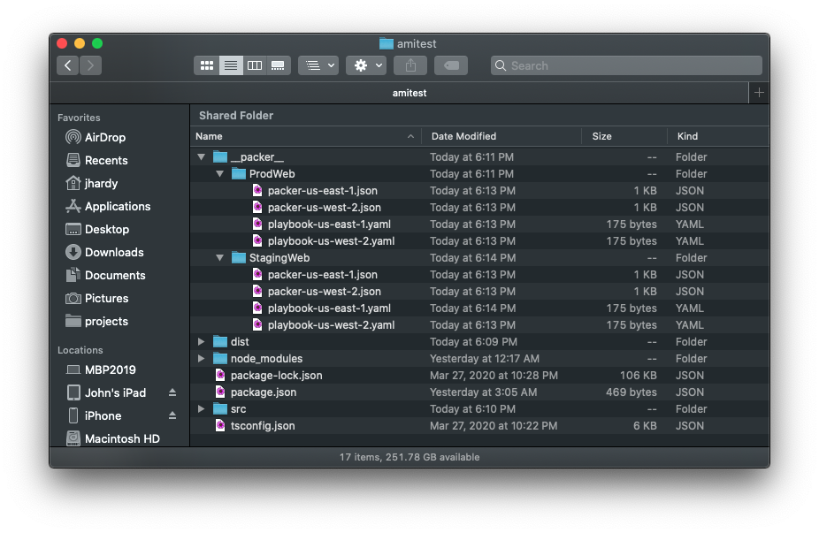
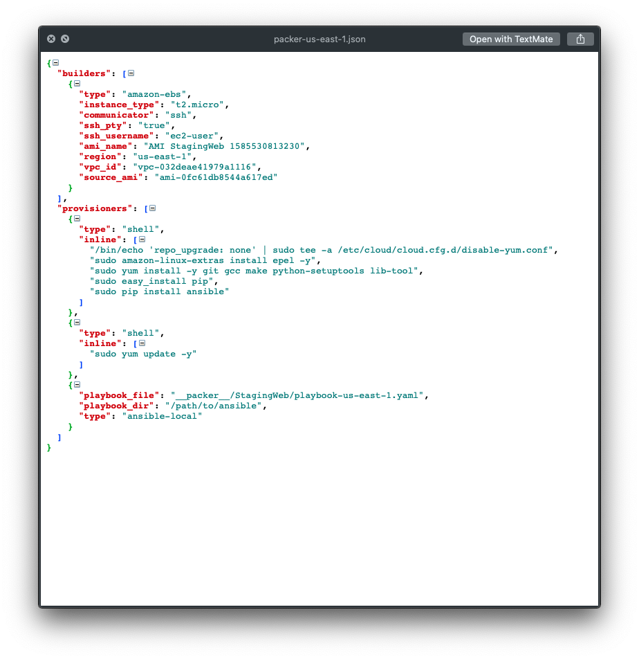
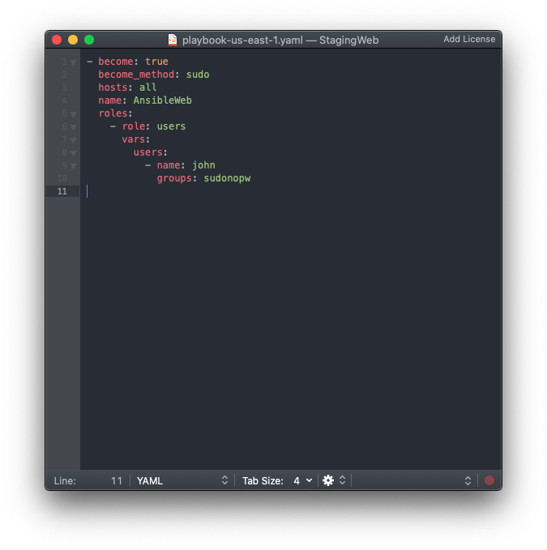

# AMI Builder

The AMI Builder is a library and CLI to define your AWS AMI's in typescript and deploy them using Hashicorp Packer. The AMI Builder library will also generate an AMI map for use with CDK to better manage your AMI's across regions and across various stages of your infrastructures (IE: Staging/Dev/Production).  

## Installation
`npm install ami-builder`

In your tsconfig.json ensure you have the esModuleInterop enabled:

```json
"esModuleInterop" : true
```

Install HashiCorp Packer:   
https://packer.io/

## Provisioners
The AMI Builder currently has the following Packer provisioners implemented.

- Shell
- Ansible (ansible-local)

## Example build file
> The below example creates a web ami with ansible provisioner and makes a staging and prod version   
> for the regions us-west-2 and us-east-1

``` typescript
// src/web-amis.ts
import * as ami_builder from 'ami-builder'

/**
 *  Function to defined a web stack ami
 */
const webAmi = (name: string) => {
    // create an Amazon Linux 2 AMI
    let ami = new ami_builder.AmazonLinux2Ami(name)

    // create an ansible provisioner
    // We set the path to our ansible foler that contains
    // our 'roles' folder
    let ansible = new ami_builder.AnsibleProvisioner(
        'AnsibleWeb',
        '/path/to/ansible'
    )

    // add a role to our build 
    // `index` is the order which the role is
    // added in the generated playbook.yaml
    ansible.addRole({
        role: 'users',
        index: 1,
        vars: {
            users: [
                {name: 'john', groups: 'sudonopw'}
            ]
        }
    })

    // add the ansible provisioner
    // will automatically add a shell provisioner
    // to install ansible on the remote machine
    ami.addProvisioner(1, ansible)

    // add to our builder queue
    ami_builder.AmiBuildQueue.add(ami)

    // return the ami
    return ami
}

// create a staging web ami
const stagingWeb = webAmi("StagingWeb")
// create a prod web ami
const prodWeb = webAmi("ProdWeb")

// add an extra shell provisioner to staging
const stagingYumUpdate= new ami_builder.ShellProvisioner("Some Shell Stuff")
// add command
stagingYumUpdate.add([
    'sudo yum update -y'
])

// prepend the shell yum update to stagingWeb
stagingWeb.prependProvisioner(stagingYumUpdate)

// add the regions we want to build in
ami_builder.AmiBuildQueue.setRegions(
    ami_builder.Regions.USWEST2,
    ami_builder.Regions.USEAST1,
)

// you then run the `ami-builder build {PATH TO COMPILED JAVASCRIPT}` to build the AMI's

```
## Packer and ansible files generated





## Example to get active images for CDK

```typescript
import * as ec2 from 'aws-cdk/aws-e2'
import * as ami_builder from 'ami-builder'

let amis = await ami_builder.AmiMapper.map("AmiName",
                                            ami_builder.Regions.USWEST1, 
                                            ami_builder.Regions.USEAST2)
ec2.MachineImage.genericLinux(amis) 
```


## TODO

- Complete unit-test coverage
- Finalize module/interface/class/function naming
    - ***Note: while names will change overall functionality/conventions/usage will not and should be re-factorable VIA simple search/replace... (lib is currently used in some production projects)***
- Add more packer provisioners
- Complete cli interface
- Code decs
- Usage examples
- ....